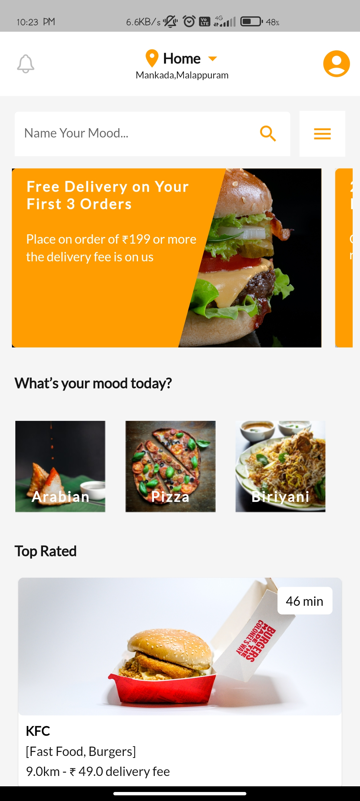
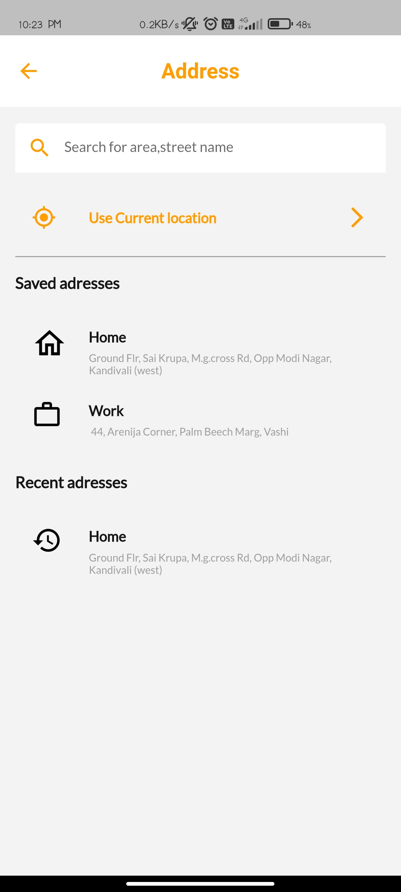
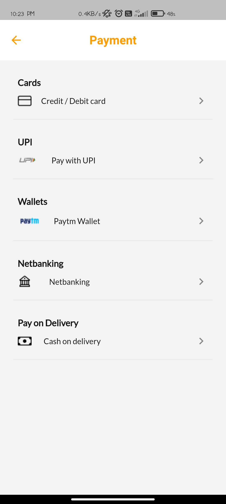

# FoodMood Food Delivery App

FoodMood is a user-friendly food delivery app built with Flutter. It allows users to explore various restaurants, view menus, place orders, and have their favorite dishes delivered right to their doorsteps.


## Features

- Browse through a list of restaurants.
- View detailed restaurant menus.
- Customize orders according to preferences.
- Add items to the cart for easy checkout.
- Track order status in real-time.
- Secure payment options for a seamless transaction.
- User profiles with order history.
- Receive notifications for order updates.

## Screenshots

<p align="center">
  
  
  
  
  
  
  
  
  
</p>

## Getting Started

Follow these steps to get the FoodMood app up and running on your local machine:

1. Make sure you have Flutter and Dart installed: [Install Flutter](https://flutter.dev/docs/get-started/install)
2. Clone this repository:
   ```sh
   git clone https://github.com/Jishnulal7/FoodMood-Food-Delivery-App.git
3. Navigate to the project directory:
   ```sh
   cd FoodMood-Food-Delivery-App
4. Install dependencies:
   ```sh
   flutter pub get
5. Run the app:
   ```sh
   flutter run

## Contributing

Contributions are welcome! If you'd like to contribute to FoodMood, follow these steps:

   1. Fork the repository.
   2. Create a new branch for your feature/fix: git checkout -b feature/your-feature-name
   3. Make your changes and test thoroughly.
   4. Commit your changes: git commit -m "Add your message"
   5. Push the changes to your branch: git push origin feature/your-feature-name
   6. Create a pull request describing your changes.

## Acknowledgments

   FoodMood was developed by Jishnulal.
